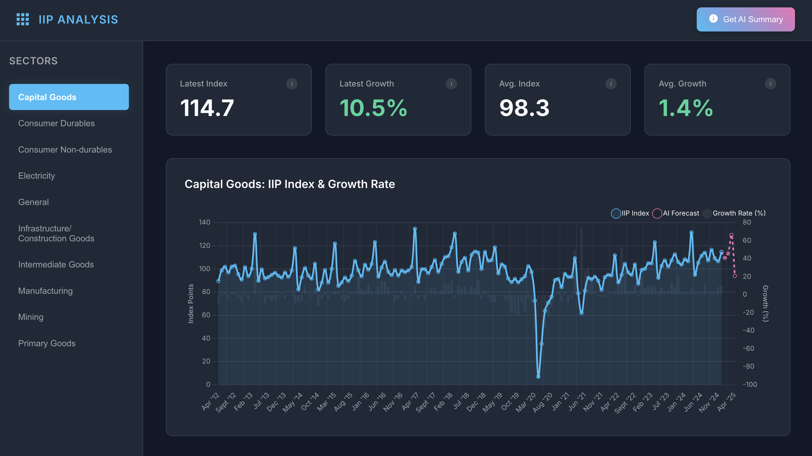
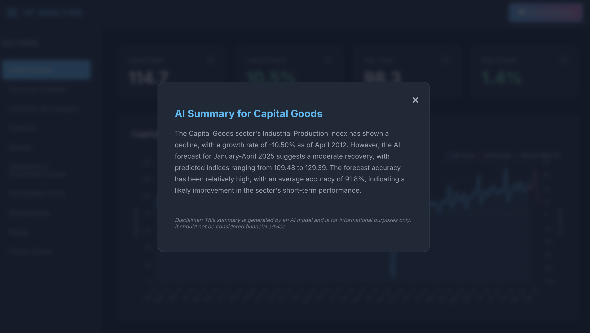

# IIP Insight – Industrial Production Forecasting Dashboard

An end-to-end analytics project that analyzes India's **Index of Industrial Production (IIP)** using **time-series forecasting** and **AI-generated economic insights**.

The project combines **Facebook Prophet** for forecasting, **Meta Llama 3** for AI-generated summaries, and an interactive JavaScript dashboard to visualize industrial production trends across multiple sectors.

---

## Live Demo

**Application:** https://your-netlify-url.netlify.app

---

# Overview

Industrial production data contains long-term trends that are difficult to interpret manually. This project processes historical IIP data, forecasts future industrial production using machine learning, and generates AI-powered summaries to present the results through an interactive dashboard.

---

#  Problem Statement

Understanding industrial production trends requires analyzing large volumes of historical data. While forecasting models can predict future values, interpreting those predictions often requires technical expertise.

This project simplifies the process by combining machine learning-based forecasting with AI-generated summaries, enabling users to quickly understand historical performance, forecast trends, and sector-wise industrial insights.

---

#  Key Features

-  Analyze historical IIP trends across **10 industrial sectors**
-  Forecast future industrial production using **Facebook Prophet**
-  Generate AI-powered economic summaries using **Meta Llama 3**
-  Interactive dashboard with historical trends, forecasts, and growth metrics
-  Automated data preprocessing and JSON-based data pipeline
-  Publicly deployed as a web application

---

#  Tech Stack

- **Frontend:** HTML, CSS, JavaScript
- **Backend:** Python, Pandas, NumPy
- **Machine Learning:** Facebook Prophet
- **AI Integration:** Meta Llama 3 (Together AI API)
- **Deployment:** Netlify

---

#  Technical Highlights

- Built an end-to-end forecasting pipeline from raw industrial data to an interactive analytics dashboard.
- Processed and transformed historical IIP datasets using Pandas and NumPy.
- Implemented sector-wise time-series forecasting using Facebook Prophet.
- Integrated Meta Llama 3 through Together AI to generate concise economic summaries from forecast results.
- Designed a modular JSON-based workflow separating backend data processing from frontend visualization.

---

#  Future Improvements

- Support custom dataset uploads.
- Compare multiple forecasting models (ARIMA, XGBoost, LSTM).
- Display confidence intervals and forecasting evaluation metrics.
- Export reports as PDF and Excel.
- Deploy the forecasting backend for real-time predictions.

---

#  Screenshots

## Dashboard

---

## AI Summary

---

#  Author

**Ashmit Garg**

 GitHub: https://github.com/Ashmit-104